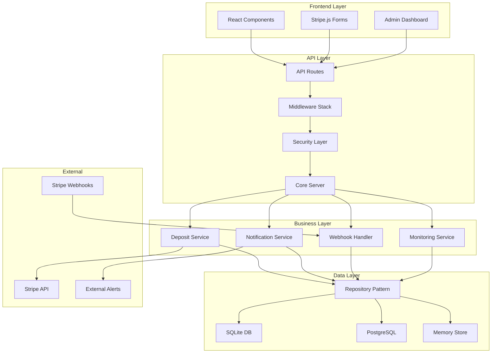
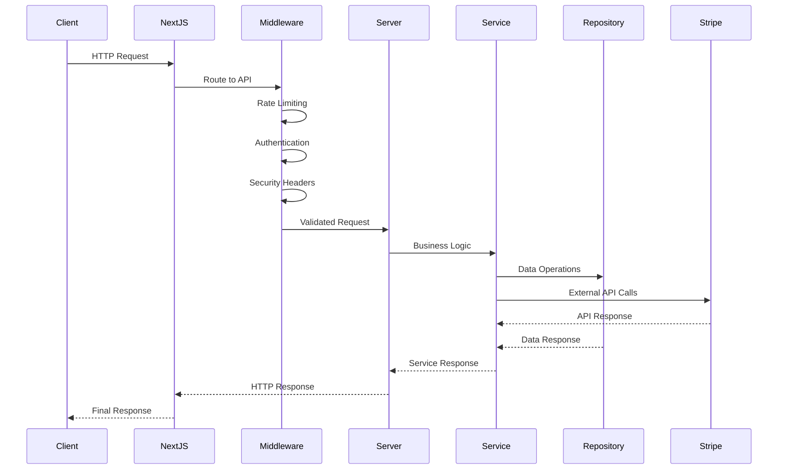
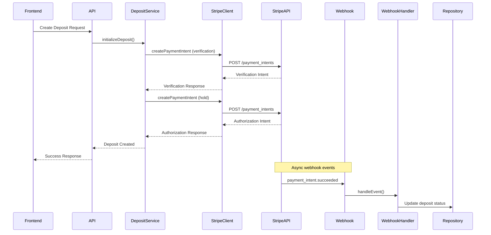
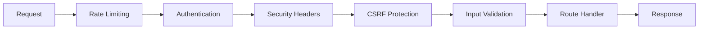
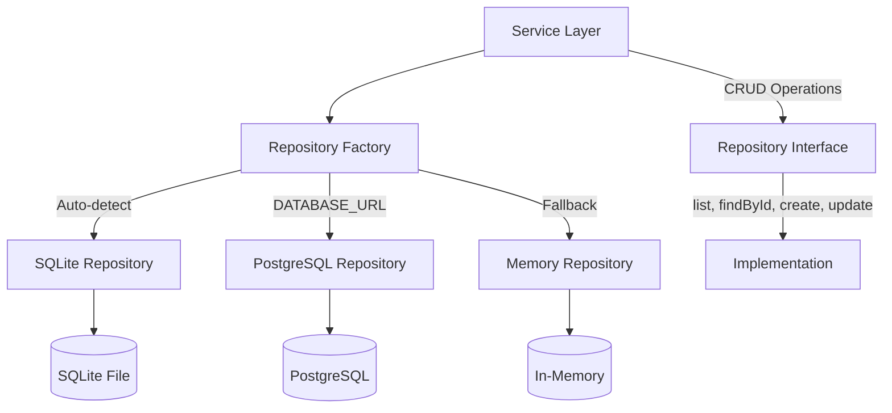
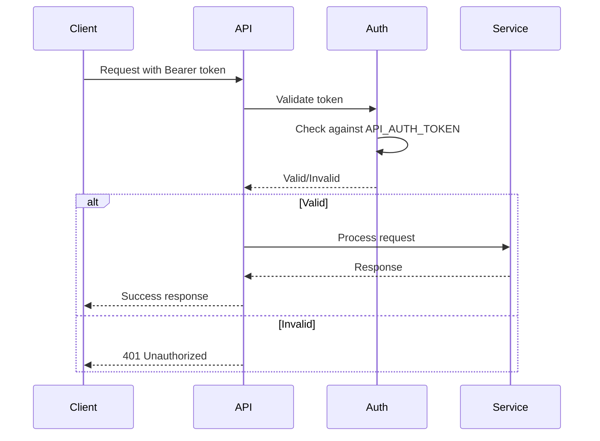

# Stripe Deposit Service - Developer Reference Guide

> **Purpose**: This guide provides architectural overview and development patterns for AI assistants and developers working with the stripe-deposit codebase. For detailed setup and operational guides, see [README.md](./README.md), [ROADMAP.md](./ROADMAP.md), and [docs/tasks/](./docs/tasks/).

## Table of Contents

1. [Quick Start for Developers](#1-quick-start-for-developers)
2. [System Architecture](#2-system-architecture)
3. [API Quick Reference](#3-api-quick-reference)
4. [Data Models & Patterns](#4-data-models--patterns)
5. [Security Implementation](#5-security-implementation)
6. [Development Patterns](#6-development-patterns)
7. [Common Tasks & Examples](#7-common-tasks--examples)
8. [References & Links](#8-references--links)

---

## 1. Quick Start for Developers

### Architecture at a Glance

```
┌─────────────────┐    ┌─────────────────┐    ┌─────────────────┐
│   Frontend      │    │   Backend API   │    │   External      │
│   (Next.js)     │◄──►│   (Node.js)     │◄──►│   (Stripe)      │
│                 │    │                 │    │                 │
│ • React Pages   │    │ • API Routes    │    │ • Payment API   │
│ • Components    │    │ • Services      │    │ • Webhooks      │
│ • Stripe.js     │    │ • Repositories  │    │                 │
└─────────────────┘    └─────────────────┘    └─────────────────┘
                                │
                       ┌─────────────────┐
                       │   Database      │
                       │   (SQLite/PG)   │
                       │                 │
                       │ • Deposits      │
                       │ • History       │
                       │ • Metadata      │
                       └─────────────────┘
```

### Key Components Map

| Component | Location | Purpose |
|-----------|----------|---------|
| **Frontend** | `pages/`, `components/` | User interface, Stripe.js integration |
| **API Routes** | `pages/api/` | HTTP endpoints, request handling |
| **Core Server** | `src/server.js` | Main HTTP server, routing, middleware |
| **Services** | `src/services/` | Business logic (deposits, notifications) |
| **Repositories** | `src/repositories/` | Data persistence layer |
| **Security** | `src/security/` | Auth, rate limiting, CSRF protection |
| **Stripe Integration** | `src/stripe/` | Stripe API client, webhook handling |

### Development Setup

📖 **See**: [README.md - Environment](./README.md#environment) for complete setup instructions.

**Quick Commands:**
```bash
npm install                    # Install dependencies
npm run dev                   # Start Next.js dev server
npm start                     # Start production server
npm run reauth-worker         # Start background worker
npm test                      # Run test suite
```

---

## 2. System Architecture

### Component Interaction Diagram



### Request Processing Flow



### Stripe Integration Flow



### Data Flow Overview

**Deposit Creation Flow:**
1. Frontend submits card details via Stripe.js
2. API creates PaymentMethod with Stripe
3. DepositService creates verification charge ($1)
4. DepositService creates authorization hold ($100/$200)
5. Repository persists deposit record
6. NotificationService logs events

**Webhook Processing Flow:**
1. Stripe sends webhook to `/api/stripe/webhook`
2. WebhookVerifier validates signature
3. WebhookHandler processes event
4. Repository updates deposit status
5. NotificationService emits alerts

**Middleware Chain Execution:**


**Repository Pattern Flow:**


### Technology Stack Details

| Layer | Technology | Purpose |
|-------|------------|---------|
| **Frontend** | Next.js 14, React 18, Tailwind CSS | UI framework, styling |
| **Backend** | Node.js 18+, Native HTTP server | Runtime, API server |
| **Database** | SQLite (better-sqlite3), PostgreSQL | Data persistence |
| **Payments** | Stripe API v14, Stripe.js v3 | Payment processing |
| **Security** | JWT, bcryptjs, Custom middleware | Authentication, security |
| **Deployment** | Vercel, Docker | Hosting, containerization |

---

## 3. API Quick Reference

### Endpoint Summary Table

#### Core API Endpoints
| Method | Endpoint | Auth | Purpose |
|--------|----------|------|---------|
| GET | `/healthz` | None | Health check |
| GET | `/metrics` | Bearer | System metrics |
| POST | `/api/deposits/create-intent` | Bearer | Create payment intent |
| GET | `/api/deposits/list` | Bearer | List deposits |
| POST | `/api/deposits/verify-card` | Bearer | Verify card details |
| POST | `/api/stripe/webhook` | Signature | Stripe webhook receiver |

#### Core Server Endpoints (src/server.js)
| Method | Endpoint | Auth | Purpose |
|--------|----------|------|---------|
| GET | `/api/deposits` | Bearer | List all deposits |
| POST | `/api/deposits/hold/100` | Bearer | Create $100 deposit hold |
| POST | `/api/deposits/hold/200` | Bearer | Create $200 deposit hold |
| GET | `/api/deposits/{id}` | Bearer | Get deposit details |
| POST | `/api/deposits/{id}/capture` | Bearer | Capture deposit amount |
| POST | `/api/deposits/{id}/release` | Bearer | Release deposit hold |
| POST | `/api/deposits/{id}/reauthorize` | Bearer | Re-authorize deposit |
| POST | `/api/deposits/{id}/resolve` | Bearer | Resolve requires_action status |

#### Admin API Endpoints
| Method | Endpoint | Auth | Purpose |
|--------|----------|------|---------|
| POST | `/api/admin/login` | None | Admin authentication |
| GET | `/api/admin/dashboard` | JWT | Admin dashboard data |
| GET | `/api/admin/deposits` | JWT | List deposits (admin view) |
| POST | `/api/admin/deposits/{id}/{action}` | JWT | Deposit actions (capture/release/refund) |
| POST | `/api/admin/deposit-action` | JWT | Perform deposit actions |
| POST | `/api/admin/analytics` | JWT | Generate analytics data |
| POST | `/api/admin/reports/generate` | JWT | Generate reports |
| GET | `/api/admin/mode` | JWT | Get/set Stripe mode |

#### Demo API Endpoints
| Method | Endpoint | Auth | Purpose |
|--------|----------|------|---------|
| GET | `/api/demo` | None | Demo API overview |
| GET | `/api/demo/health` | None | Demo health check |
| GET | `/api/demo/deposits` | None | List demo deposits |
| POST | `/api/demo/deposits/hold/{amount}` | None | Create demo deposit hold |
| GET | `/api/demo/deposits/{id}` | None | Get demo deposit details |
| POST | `/api/demo/deposits/{id}/{action}` | None | Demo deposit actions |

### Authentication Patterns

**API Token Authentication:**
```javascript
// Headers
Authorization: Bearer <API_AUTH_TOKEN>

// Usage in requests
const response = await fetch('/api/deposits/list', {
  headers: {
    'Authorization': `Bearer ${process.env.API_AUTH_TOKEN}`,
    'Content-Type': 'application/json'
  }
});
```

**Admin JWT Authentication:**
```javascript
// Headers
Authorization: Bearer <JWT_TOKEN>

// Token structure
{
  "id": "admin_id",
  "role": "admin",
  "iat": 1234567890,
  "exp": 1234567890
}
```

### Request/Response Examples

**Create Deposit Intent:**
```javascript
// Request
POST /api/deposits/create-intent
Headers: {
  "Authorization": "Bearer <API_AUTH_TOKEN>",
  "Content-Type": "application/json",
  "x-stripe-mode": "test" // or "live"
}
Body: {
  "amount": 10000,
  "currency": "usd",
  "customerId": "customer_123",
  "paymentMethodId": "pm_1234567890",
  "metadata": {
    "created_via": "api"
  }
}

// Response (Success)
{
  "success": true,
  "paymentIntent": {
    "id": "pi_1234567890",
    "client_secret": "pi_1234567890_secret_abc",
    "status": "requires_confirmation",
    "amount": 10000,
    "currency": "usd",
    "created": 1640995200,
    "metadata": { "customerId": "customer_123" }
  },
  "mode": "test"
}

// Response (Error)
{
  "error": "Invalid amount",
  "message": "Amount must be a positive integer"
}
```

**Verify Card:**
```javascript
// Request
POST /api/deposits/verify-card
Headers: {
  "Authorization": "Bearer <API_AUTH_TOKEN>",
  "Content-Type": "application/json"
}
Body: {
  "cardNumber": "4242424242424242",
  "expiryMonth": "12",
  "expiryYear": "2025",
  "cvc": "123"
}

// Response
{
  "success": true,
  "currency": "usd",
  "cardType": "visa",
  "country": "US"
}
```

**List Deposits:**
```javascript
// Request
GET /api/deposits/list
Headers: {
  "Authorization": "Bearer <API_AUTH_TOKEN>",
  "x-stripe-mode": "test"
}

// Response
{
  "success": true,
  "deposits": [
    {
      "id": "pi_demo_thb_154",
      "customerId": "cus_demo_thai_user",
      "amount": 15400,
      "currency": "thb",
      "status": "pending",
      "createdAt": "2025-09-26T10:30:00.000Z"
    }
  ]
}
```

**Admin Deposit Action:**
```javascript
// Request
POST /api/admin/deposits/pi_1234567890/capture
Headers: {
  "Authorization": "Bearer <JWT_TOKEN>",
  "Content-Type": "application/json"
}
Body: {
  "amount": 5000 // Optional: partial capture
}

// Response
{
  "success": true,
  "action": "capture",
  "depositId": "pi_1234567890",
  "amount": 5000,
  "result": {
    "id": "pi_1234567890",
    "status": "succeeded",
    "amount_received": 5000
  }
}
```

**Stripe Webhook:**
```javascript
// Request
POST /api/stripe/webhook
Headers: {
  "stripe-signature": "t=1640995200,v1=abc123...",
  "Content-Type": "application/json"
}
Body: {
  "id": "evt_1234567890",
  "type": "payment_intent.succeeded",
  "data": {
    "object": {
      "id": "pi_1234567890",
      "status": "succeeded",
      "amount": 10000
    }
  }
}

// Response
{
  "received": true
}
```

---

## 4. Data Models & Patterns

### Deposit Entity Model

```typescript
interface Deposit {
  id: string;                           // UUID
  customerId: string;                   // Customer identifier
  paymentMethodId: string;              // Stripe payment method ID
  currency: string;                     // ISO currency code
  holdAmount: number;                   // Amount in cents
  status: DepositStatus;                // Current status
  
  // Payment Intent IDs
  verificationPaymentIntentId?: string;
  activePaymentIntentId?: string;
  capturePaymentIntentId?: string;
  
  // Amounts
  capturedAmount?: number;
  releasedAmount?: number;
  
  // Timestamps
  createdAt: string;                    // ISO string
  initialAuthorizationAt?: string;
  lastAuthorizationAt?: string;
  capturedAt?: string;
  releasedAt?: string;
  
  // History and metadata
  metadata?: Record<string, any>;
  captureHistory?: CaptureHistoryEntry[];
  authorizationHistory?: AuthorizationHistoryEntry[];
  lastError?: ErrorInfo;
  actionRequired?: ActionRequiredInfo;
}

type DepositStatus = 
  | 'pending'
  | 'authorized' 
  | 'captured'
  | 'released'
  | 'failed'
  | 'requires_action';
```

### Repository Pattern Usage

**Interface Definition:**
```javascript
class DepositRepository {
  async list() { /* Return all deposits */ }
  async findById(id) { /* Find by ID */ }
  async create(deposit) { /* Create new */ }
  async update(id, updateFn) { /* Update with function */ }
  async findOlderThan(date, limit) { /* Find old deposits */ }
  async healthCheck() { /* Check repository health */ }
  async close() { /* Close connections */ }
}
```

**Implementation Selection:**
```javascript
// Auto-detection based on environment
const repository = createDepositRepository({
  type: 'auto',  // auto, sqlite, postgres, memory, file
  filePath: './data/deposits.sqlite',
  connectionString: process.env.DATABASE_URL
});

// Explicit type selection
const sqliteRepo = createDepositRepository({
  type: 'sqlite',
  filePath: './data/deposits.sqlite'
});

const postgresRepo = createDepositRepository({
  type: 'postgres',
  connectionString: process.env.DATABASE_URL,
  ssl: { rejectUnauthorized: false }
});

const memoryRepo = createDepositRepository({
  type: 'memory'
});
```

**Repository Factory Logic:**
```javascript
// Factory auto-detection flow
function createDepositRepository(options) {
  if (type === 'auto') {
    // 1. Check for PostgreSQL connection string
    if (process.env.DATABASE_URL) {
      return new PostgresDepositRepository(options);
    }

    // 2. Try SQLite (requires better-sqlite3)
    try {
      return new SqliteDepositRepository(options);
    } catch (error) {
      // 3. Fallback to memory repository
      return new MemoryDepositRepository(options);
    }
  }

  // Explicit type selection...
}
```

**Update Pattern with Functional Updates:**
```javascript
// Functional update pattern used throughout the codebase
const updatedDeposit = await repository.update(depositId, (current) => ({
  ...current,
  status: 'captured',
  capturedAmount: amount,
  capturedAt: new Date().toISOString(),
  captureHistory: [
    ...(current.captureHistory || []),
    {
      paymentIntentId: captureResponse.id,
      amount,
      capturedAt: new Date().toISOString()
    }
  ]
}));
```

### Database Schema Reference

**SQLite Schema:**
```sql
CREATE TABLE deposits (
  id TEXT PRIMARY KEY,
  customer_id TEXT NOT NULL,
  payment_method_id TEXT NOT NULL,
  currency TEXT NOT NULL DEFAULT 'usd',
  hold_amount INTEGER NOT NULL,
  status TEXT NOT NULL,
  verification_payment_intent_id TEXT,
  active_payment_intent_id TEXT,
  capture_payment_intent_id TEXT,
  captured_amount INTEGER,
  released_amount INTEGER,
  created_at TEXT,
  initial_authorization_at TEXT,
  last_authorization_at TEXT,
  captured_at TEXT,
  released_at TEXT,
  metadata_json TEXT,
  capture_history_json TEXT,
  authorization_history_json TEXT,
  last_error_json TEXT,
  action_required_json TEXT
);

-- Indexes for performance
CREATE INDEX idx_deposits_customer_id ON deposits(customer_id);
CREATE INDEX idx_deposits_status ON deposits(status);
CREATE INDEX idx_deposits_created_at ON deposits(created_at);
CREATE INDEX idx_deposits_last_authorization_at ON deposits(last_authorization_at);
```

**PostgreSQL Schema:**
```sql
CREATE TABLE deposits (
  id TEXT PRIMARY KEY,
  customer_id TEXT NOT NULL,
  payment_method_id TEXT NOT NULL,
  currency TEXT NOT NULL DEFAULT 'usd',
  hold_amount INTEGER NOT NULL,
  status TEXT NOT NULL,
  verification_payment_intent_id TEXT,
  active_payment_intent_id TEXT,
  capture_payment_intent_id TEXT,
  captured_amount INTEGER,
  released_amount INTEGER,
  created_at TIMESTAMPTZ,
  initial_authorization_at TIMESTAMPTZ,
  last_authorization_at TIMESTAMPTZ,
  captured_at TIMESTAMPTZ,
  released_at TIMESTAMPTZ,
  metadata_json JSONB,
  capture_history_json JSONB,
  authorization_history_json JSONB,
  last_error_json JSONB,
  action_required_json JSONB
);

-- Indexes for performance
CREATE INDEX idx_deposits_customer_id ON deposits(customer_id);
CREATE INDEX idx_deposits_status ON deposits(status);
CREATE INDEX idx_deposits_created_at ON deposits(created_at);
CREATE INDEX idx_deposits_last_authorization_at ON deposits(last_authorization_at);
CREATE INDEX idx_deposits_metadata_gin ON deposits USING GIN(metadata_json);
```

**Data Type Mappings:**

| Field | SQLite | PostgreSQL | Memory | Notes |
|-------|--------|------------|--------|-------|
| Timestamps | TEXT (ISO) | TIMESTAMPTZ | Date objects | ISO 8601 strings |
| JSON Data | TEXT | JSONB | Objects | Serialized in SQLite |
| Amounts | INTEGER | INTEGER | Number | Always in cents |
| IDs | TEXT | TEXT | String | UUIDs or Stripe IDs |

**JSON Field Structures:**
```typescript
// metadata_json
{
  "created_via": "api",
  "customer_email": "user@example.com",
  "rental_property": "property_123",
  "custom_field": "value"
}

// capture_history_json
[
  {
    "paymentIntentId": "pi_1234567890",
    "amount": 5000,
    "capturedAt": "2025-09-26T10:30:00.000Z"
  }
]

// authorization_history_json
[
  {
    "paymentIntentId": "pi_1234567890",
    "amount": 10000,
    "authorizedAt": "2025-09-26T10:00:00.000Z"
  }
]

// last_error_json
{
  "code": "card_declined",
  "message": "Your card was declined.",
  "type": "card_error",
  "timestamp": "2025-09-26T10:30:00.000Z"
}

// action_required_json
{
  "type": "use_stripe_sdk",
  "clientSecret": "pi_1234567890_secret_abc",
  "paymentIntentId": "pi_1234567890",
  "nextAction": {
    "type": "use_stripe_sdk",
    "use_stripe_sdk": {
      "type": "three_d_secure_redirect",
      "stripe_js": "https://js.stripe.com/v3/"
    }
  }
}
```

---

## 5. Security Implementation

### Authentication Flow



### Rate Limiting Configuration

```javascript
// Rate limit configurations
const RATE_LIMITS = {
  global: { windowMs: 60000, maxRequests: 100 },
  api: { windowMs: 60000, maxRequests: 60 },
  deposits: { windowMs: 60000, maxRequests: 10 },
  auth: { windowMs: 900000, maxRequests: 5 }
};

// Usage
const rateLimiter = createRateLimitMiddleware('deposits', RATE_LIMITS.deposits);
```

### Security Middleware Usage

**Environment-Based Security Configuration:**
```javascript
// Development vs Production security configs
const SECURITY_CONFIGS = {
  development: {
    rateLimiting: {
      global: { windowMs: 60000, maxRequests: 1000 },
      api: { windowMs: 60000, maxRequests: 300 },
      deposits: { windowMs: 60000, maxRequests: 50 }
    },
    csrf: { enabled: false },
    validation: { strict: false }
  },
  production: {
    rateLimiting: {
      global: { windowMs: 60000, maxRequests: 100 },
      api: { windowMs: 60000, maxRequests: 60 },
      deposits: { windowMs: 60000, maxRequests: 10 }
    },
    csrf: { enabled: true, tokenExpiry: 3600000 },
    validation: { strict: true }
  }
};
```

**Endpoint-Specific Security:**
```javascript
// Public endpoints (minimal security)
const publicSecurity = createEndpointSecurity('public');

// API endpoints (full security stack)
const apiSecurity = createEndpointSecurity('api', {
  rateLimiting: { windowMs: 60000, maxRequests: 60 },
  authentication: { apiToken: process.env.API_AUTH_TOKEN }
});

// Deposit endpoints (enhanced security)
const depositSecurity = createEndpointSecurity('deposits', {
  rateLimiting: { windowMs: 60000, maxRequests: 10 },
  authentication: { apiToken: process.env.API_AUTH_TOKEN },
  validation: { strict: true }
});

// Webhook endpoints (signature verification)
const webhookSecurity = createEndpointSecurity('webhook', {
  rateLimiting: { windowMs: 60000, maxRequests: 1000 }
});
```

**Vercel Serverless Security Wrapper:**
```javascript
// Wrap serverless functions with security
export default withSecurity(async (req, res) => {
  // Your handler logic
  return res.json({ success: true });
}, 'deposits', {
  customRateLimit: { windowMs: 30000, maxRequests: 5 }
});
```

**Security Headers Configuration:**
```javascript
const securityHeaders = {
  'X-Content-Type-Options': 'nosniff',
  'X-Frame-Options': 'DENY',
  'X-XSS-Protection': '1; mode=block',
  'Referrer-Policy': 'strict-origin-when-cross-origin',
  'Content-Security-Policy': "default-src 'self'; script-src 'self' https://js.stripe.com",
  'Strict-Transport-Security': 'max-age=31536000; includeSubDomains'
};
```

---

## 6. Development Standards & Patterns

### File Organization Conventions

**Project Structure:**
```
stripe-deposit/
├── components/           # React components
│   ├── ui/              # Reusable UI components
│   ├── admin/           # Admin-specific components
│   ├── layout/          # Layout components
│   └── accessibility/   # Accessibility utilities
├── pages/               # Next.js pages and API routes
│   ├── api/            # API endpoints
│   │   ├── admin/      # Admin API routes
│   │   ├── deposits/   # Deposit-related APIs
│   │   └── stripe/     # Stripe integration APIs
│   └── admin/          # Admin pages
├── src/                 # Core business logic
│   ├── auth/           # Authentication middleware
│   ├── jobs/           # Background jobs
│   ├── monitoring/     # Monitoring and health checks
│   ├── repositories/   # Data access layer
│   ├── security/       # Security middleware
│   ├── services/       # Business logic services
│   ├── stripe/         # Stripe integration
│   └── utils/          # Utility functions
├── lib/                 # Shared libraries
├── styles/             # CSS and styling
├── scripts/            # Utility scripts
├── tests/              # Test files
├── docs/               # Documentation
└── data/               # Data files and databases
```

**Naming Conventions:**

| Type | Convention | Example |
|------|------------|---------|
| **Files** | kebab-case | `deposit-service.js` |
| **Components** | PascalCase | `DepositForm.js` |
| **API Routes** | kebab-case | `create-intent.js` |
| **Classes** | PascalCase | `DepositService` |
| **Functions** | camelCase | `createDeposit()` |
| **Constants** | UPPER_SNAKE_CASE | `API_AUTH_TOKEN` |
| **Directories** | kebab-case | `admin-panel/` |

**File Naming Patterns:**
```
# Components
ComponentName.js          # React component
ComponentName.test.js     # Component tests

# API Routes
endpoint-name.js          # API endpoint
[dynamic-param].js        # Dynamic route
[...catch-all].js         # Catch-all route

# Services and Classes
ServiceName.js            # Service class
serviceName.test.js       # Service tests

# Utilities
utility-name.js           # Utility functions
utility-name.test.js      # Utility tests

# Scripts
script-name.js            # Executable script
test-feature.js           # Test script
```

### Coding Standards

**JavaScript/Node.js Conventions:**
```javascript
// Use const/let, avoid var
const apiKey = process.env.STRIPE_SECRET_KEY;
let currentStatus = 'pending';

// Destructuring for cleaner code
const { customerId, amount, currency } = request.body;

// Template literals for strings
const message = `Deposit ${depositId} created for ${amount} ${currency}`;

// Arrow functions for callbacks
const deposits = await repository.list()
  .then(results => results.filter(d => d.status === 'active'));

// Async/await over promises
async function createDeposit(params) {
  try {
    const result = await stripeClient.createPaymentIntent(params);
    return result;
  } catch (error) {
    logger.error('Deposit creation failed', { error: error.message });
    throw error;
  }
}

// Object spread for immutable updates
const updatedDeposit = {
  ...currentDeposit,
  status: 'captured',
  capturedAt: new Date().toISOString()
};
```

**Error Handling Standards:**
```javascript
// Service layer error handling
class DepositService {
  async createDeposit(params) {
    try {
      // Business logic
    } catch (error) {
      this.logger.error('Operation failed', {
        operation: 'createDeposit',
        error: error.message,
        params: { customerId: params.customerId }
      });

      // Transform to business error
      throw new DepositError('Failed to create deposit', {
        code: 'DEPOSIT_CREATION_FAILED',
        originalError: error
      });
    }
  }
}

// API route error handling
export default async function handler(req, res) {
  try {
    const result = await processRequest(req);
    return res.status(200).json({ success: true, data: result });
  } catch (error) {
    if (error instanceof ValidationError) {
      return res.status(400).json({
        error: error.message,
        code: 'VALIDATION_ERROR'
      });
    }

    console.error('API error:', error);
    return res.status(500).json({
      error: 'Internal server error',
      code: 'INTERNAL_ERROR'
    });
  }
}
```

## 7. Development Patterns

### Error Handling Patterns

**Service Layer Error Handling:**
```javascript
class DepositService {
  async createDeposit(params) {
    try {
      // Business logic
      const result = await this.processDeposit(params);
      return result;
    } catch (error) {
      this.logger.error('Deposit creation failed', {
        error: error.message,
        customerId: params.customerId,
        amount: params.amount
      });
      
      // Transform to business error
      throw new DepositError('Failed to create deposit', {
        code: 'DEPOSIT_CREATION_FAILED',
        originalError: error
      });
    }
  }
}
```

**API Route Error Handling:**
```javascript
export default async function handler(req, res) {
  try {
    // Request processing
    const result = await processRequest(req);
    return res.status(200).json({ success: true, data: result });
  } catch (error) {
    console.error('API error:', error);
    
    if (error instanceof ValidationError) {
      return res.status(400).json({ error: error.message });
    }
    
    return res.status(500).json({ 
      error: 'Internal server error',
      code: 'INTERNAL_ERROR'
    });
  }
}
```

### Logging Standards

**Structured Logging:**
```javascript
const logger = buildLogger('service-name');

// Info logging
logger.info('Operation completed', {
  operation: 'deposit_creation',
  depositId: 'dep_123',
  customerId: 'cus_456',
  amount: 10000,
  duration: 1250
});

// Error logging
logger.error('Operation failed', {
  error: error.message,
  stack: error.stack,
  context: { depositId, customerId }
});
```

### Testing Patterns

**Service Testing:**
```javascript
describe('DepositService', () => {
  let service, mockRepository, mockStripeClient;
  
  beforeEach(() => {
    mockRepository = new MockDepositRepository();
    mockStripeClient = new MockStripeClient();
    service = new DepositService({
      repository: mockRepository,
      stripeClient: mockStripeClient
    });
  });
  
  test('should create deposit successfully', async () => {
    // Arrange
    const params = { customerId: 'cus_123', holdAmount: 10000 };
    
    // Act
    const result = await service.initializeDeposit(params);
    
    // Assert
    expect(result.status).toBe('authorized');
    expect(mockRepository.create).toHaveBeenCalled();
  });
});
```

### Stripe Integration Patterns

**Retry Pattern with Exponential Backoff:**
```javascript
class StripeClientWrapper {
  constructor(apiKey, options = {}) {
    this.stripe = new Stripe(apiKey);
    this.retryConfig = options.retry || { maxRetries: 3, backoff: 1000 };
    this.logger = options.logger || console;
  }

  async withRetry(operation, context = {}) {
    let lastError;

    for (let attempt = 1; attempt <= this.retryConfig.maxRetries; attempt++) {
      try {
        return await operation();
      } catch (error) {
        lastError = error;

        if (!this.isRetryableError(error) || attempt === this.retryConfig.maxRetries) {
          throw error;
        }

        const delay = this.retryConfig.backoff * Math.pow(2, attempt - 1);
        this.logger.warn('Stripe operation failed, retrying', {
          attempt, delay, error: error.message, context
        });

        await new Promise(resolve => setTimeout(resolve, delay));
      }
    }

    throw lastError;
  }

  isRetryableError(error) {
    return error.type === 'StripeConnectionError' ||
           error.type === 'StripeAPIError' && error.statusCode >= 500;
  }
}
```

### Repository Update Patterns

**Functional Update Pattern:**
```javascript
// Functional update pattern used throughout
async function updateDeposit(repository, depositId, updateFn) {
  return await repository.update(depositId, (current) => {
    const updated = updateFn(current);

    // Always update timestamp
    updated.updatedAt = new Date().toISOString();

    // Validate the update
    validateDepositState(updated);

    return updated;
  });
}

// Usage examples
const capturedDeposit = await updateDeposit(repository, depositId, (deposit) => ({
  ...deposit,
  status: 'captured',
  capturedAmount: amount,
  capturedAt: new Date().toISOString(),
  captureHistory: [
    ...(deposit.captureHistory || []),
    { amount, capturedAt: new Date().toISOString() }
  ]
}));
```

---

## 8. Common Tasks & Examples

### Adding New API Endpoints

**1. Create API Route File:**
```javascript
// pages/api/deposits/new-endpoint.js
export default async function handler(req, res) {
  if (req.method !== 'POST') {
    return res.status(405).json({ error: 'Method not allowed' });
  }
  
  // Add authentication
  const authResult = verifyAdminAuth(req);
  if (!authResult.success) {
    return res.status(401).json({ error: 'Unauthorized' });
  }
  
  try {
    // Process request
    const result = await processNewEndpoint(req.body);
    return res.status(200).json({ success: true, data: result });
  } catch (error) {
    return res.status(500).json({ error: error.message });
  }
}
```

**2. Add to Server Routes (if using core server):**
```javascript
// src/server.js
if (pathname === '/api/deposits/new-endpoint' && req.method === 'POST') {
  // Handle endpoint
  const result = await handleNewEndpoint(req, res);
  return;
}
```

### Implementing New Repository

**1. Create Repository Class:**
```javascript
// src/repositories/newRepository.js
class NewRepository {
  constructor(options) {
    this.options = options;
  }
  
  async list() { /* Implementation */ }
  async findById(id) { /* Implementation */ }
  async create(entity) { /* Implementation */ }
  async update(id, updateFn) { /* Implementation */ }
}
```

**2. Add to Factory:**
```javascript
// src/repositories/repositoryFactory.js
function createRepository(options) {
  switch (options.type) {
    case 'new':
      return new NewRepository(options);
    // ... other cases
  }
}
```

### Adding Security Middleware

**1. Create Middleware:**
```javascript
// src/security/newMiddleware.js
function createNewSecurityMiddleware(options = {}) {
  return (req, res, next) => {
    // Security logic
    if (!isSecure(req)) {
      return res.status(403).json({ error: 'Security check failed' });
    }
    next();
  };
}
```

**2. Apply to Routes:**
```javascript
// In server.js or API route
const newSecurityMiddleware = createNewSecurityMiddleware();
app.use('/api/secure-endpoint', newSecurityMiddleware);
```

---

## 8. References & Links

### Existing Documentation Index

#### Core Documentation
- **[README.md](./README.md)** - Main project documentation, setup, API overview
  - Environment setup and configuration
  - API endpoint overview and usage examples
  - Development and production deployment guides
- **[ROADMAP.md](./ROADMAP.md)** - Project status, completed features, changelog
  - Feature implementation timeline
  - Completed tasks and milestones
  - Known issues and future plans
- **[STRIPE_SETUP.md](./STRIPE_SETUP.md)** - Stripe configuration and troubleshooting
  - Step-by-step Stripe account setup
  - Webhook configuration
  - Live vs test mode configuration

#### Task-Based Implementation Guides
- **[docs/tasks/README.md](./docs/tasks/README.md)** - Task overview and organization
- **[docs/tasks/task-1.1-basic-deposit-api.md](./docs/tasks/task-1.1-basic-deposit-api.md)** - Basic API implementation
- **[docs/tasks/task-1.2-stripe-integration.md](./docs/tasks/task-1.2-stripe-integration.md)** - Stripe payment integration
- **[docs/tasks/task-1.3-api-authorization-fix.md](./docs/tasks/task-1.3-api-authorization-fix.md)** - Authentication implementation
- **[docs/tasks/task-2.1-database-setup.md](./docs/tasks/task-2.1-database-setup.md)** - Database configuration
- **[docs/tasks/task-3.1-admin-panel.md](./docs/tasks/task-3.1-admin-panel.md)** - Admin interface development

#### Testing and Performance
- **[docs/TESTING_GUIDE.md](./docs/TESTING_GUIDE.md)** - Testing strategies and examples
  - Unit, integration, and e2e testing patterns
  - Mock implementations and test data
- **[docs/LOAD_TESTING_GUIDE.md](./docs/LOAD_TESTING_GUIDE.md)** - Performance testing guide
  - Load testing scenarios and tools
  - Performance benchmarks and optimization

### External Resources

#### Core Technologies
- **[Stripe API Documentation](https://stripe.com/docs/api)** - Official Stripe API reference
  - Payment Intents API for deposit holds
  - Webhook events and handling
  - Test cards and error simulation
- **[Next.js Documentation](https://nextjs.org/docs)** - Next.js framework documentation
  - API routes and middleware
  - Serverless function deployment
  - Static and dynamic rendering
- **[Vercel Documentation](https://vercel.com/docs)** - Deployment platform documentation
  - Environment variable configuration
  - Function limits and optimization
  - Domain and SSL configuration

#### Database and Libraries
- **[better-sqlite3 Documentation](https://github.com/WiseLibs/better-sqlite3)** - SQLite driver documentation
- **[PostgreSQL Documentation](https://www.postgresql.org/docs/)** - PostgreSQL database documentation
- **[JWT.io](https://jwt.io/)** - JSON Web Token documentation and debugging

### Troubleshooting Quick Links

#### Common Issues
- **Stripe Integration**: [STRIPE_SETUP.md - Troubleshooting](./STRIPE_SETUP.md#step-5-troubleshooting)
  - Live vs test key configuration
  - Webhook signature verification
  - Payment intent status handling
- **Database Setup**: [docs/tasks/task-2.1-database-setup.md](./docs/tasks/task-2.1-database-setup.md)
  - Repository auto-detection
  - SQLite vs PostgreSQL configuration
  - Connection pooling and performance
- **Authentication**: [docs/tasks/task-1.3-api-authorization-fix.md](./docs/tasks/task-1.3-api-authorization-fix.md)
  - API token configuration
  - JWT token handling
  - Admin authentication flow
- **Testing Setup**: [docs/TESTING_GUIDE.md](./docs/TESTING_GUIDE.md)
  - Test environment configuration
  - Mock implementations
  - CI/CD pipeline setup

#### Development Workflow
- **Getting Started**: [README.md - Quick Start](./README.md#quick-start)
- **Environment Setup**: [README.md - Environment](./README.md#environment)
- **API Testing**: [README.md - API Endpoints](./README.md#api-endpoints)
- **Deployment**: [README.md - Deployment](./README.md#deployment)

---

## 9. Testing & Deployment

### Testing Strategy

**Test Organization:**
```
tests/
├── unit/                    # Unit tests
│   ├── services/           # Service layer tests
│   ├── repositories/       # Repository tests
│   └── utils/              # Utility function tests
├── integration/            # Integration tests
│   ├── api/               # API endpoint tests
│   ├── stripe/            # Stripe integration tests
│   └── database/          # Database tests
├── e2e/                   # End-to-end tests
│   ├── deposit-flow/      # Complete deposit workflows
│   └── admin-panel/       # Admin functionality tests
└── fixtures/              # Test data and mocks
    ├── stripe-responses/  # Mock Stripe API responses
    └── deposits/          # Sample deposit data
```

**Testing Commands:**
```bash
# Run all tests
npm test

# Run specific test suites
npm run test:unit
npm run test:integration
npm run test:e2e

# Run tests with coverage
npm run test:coverage

# Run tests in watch mode
npm run test:watch
```

### Deployment Process

**Vercel Configuration:**
```javascript
// vercel.json
{
  "version": 2,
  "functions": {
    "pages/api/**/*.js": {
      "maxDuration": 30
    }
  },
  "env": {
    "NODE_ENV": "production"
  }
}
```

**Environment Variables:**
```bash
# Required for production
STRIPE_SECRET_KEY=sk_live_...
STRIPE_PUBLISHABLE_KEY=pk_live_...
STRIPE_WEBHOOK_SECRET=whsec_...
API_AUTH_TOKEN=secure_production_token
DATABASE_URL=postgresql://production_url
NODE_ENV=production
```

**Pre-deployment Checklist:**
- ✅ All tests passing
- ✅ Environment variables configured
- ✅ Stripe webhooks configured
- ✅ Security middleware enabled
- ✅ Rate limiting configured
- ✅ Database migrations applied

---

## 10. Troubleshooting Guide

### Common Issues & Solutions

#### Stripe Integration Issues

**Issue: "No such payment_intent" error**
```
Error: No such payment_intent: 'pi_invalid_id'
```
**Causes & Solutions:**
- **Wrong Stripe mode**: Check `x-stripe-mode` header matches your keys
- **Test vs Live keys**: Verify you're using the correct environment keys
- **Payment intent expired**: Create a new payment intent
- **Invalid ID format**: Ensure payment intent ID starts with `pi_`

**Issue: "Your card was declined"**
```
Error: Your card was declined. (card_declined)
```
**Debugging Steps:**
1. Check if using test card numbers in test mode
2. Verify card details are correctly formatted
3. Check Stripe Dashboard for decline reason
4. Test with different test cards (4000000000000002 for declines)

**Issue: Webhook signature verification failed**
```
Error: Webhook signature verification failed
```
**Solutions:**
- Verify `STRIPE_WEBHOOK_SECRET` environment variable
- Check webhook endpoint URL in Stripe Dashboard
- Ensure raw body is passed to verification
- Test webhook locally with Stripe CLI: `stripe listen --forward-to localhost:3000/api/stripe/webhook`

#### Database Issues

**Issue: "SQLITE_BUSY: database is locked"**
**Solutions:**
- Check for long-running transactions
- Ensure database connections are properly closed
- Consider connection pooling for high concurrency
- Switch to PostgreSQL for production

**Issue: Repository auto-detection fails**
**Debugging:**
```javascript
// Check repository type detection
console.log('DATABASE_URL:', process.env.DATABASE_URL);
console.log('Repository type:', repository.constructor.name);
```

#### Authentication Issues

**Issue: "Unauthorized" on API calls**
**Checklist:**
- Verify `Authorization: Bearer <token>` header format
- Check `API_AUTH_TOKEN` environment variable
- Ensure token matches exactly (no extra spaces)
- Test with curl: `curl -H "Authorization: Bearer $API_AUTH_TOKEN" https://your-app.vercel.app/api/deposits/list`

**Issue: Admin JWT token expired**
**Solutions:**
- Check token expiration time in admin login
- Implement token refresh mechanism
- Clear browser localStorage and re-login

#### Rate Limiting Issues

**Issue: "Too Many Requests" (429 status)**
**Solutions:**
- Check rate limit configuration in security middleware
- Implement exponential backoff in client
- Consider increasing limits for legitimate use cases
- Monitor rate limit metrics

#### Deployment Issues

**Issue: Vercel function timeout**
```
Error: Function execution timed out after 30.00 seconds
```
**Solutions:**
- Optimize database queries
- Implement proper connection pooling
- Add request timeouts to external API calls
- Consider breaking down large operations

**Issue: Environment variables not loading**
**Debugging:**
```javascript
// Check environment variables
console.log('Environment check:', {
  NODE_ENV: process.env.NODE_ENV,
  hasStripeKey: !!process.env.STRIPE_SECRET_KEY,
  hasApiToken: !!process.env.API_AUTH_TOKEN
});
```

### Debugging Tools

**Health Check Endpoints:**
```bash
# Check application health
curl https://your-app.vercel.app/healthz

# Check metrics (requires auth)
curl -H "Authorization: Bearer $API_AUTH_TOKEN" \
     https://your-app.vercel.app/metrics
```

**Stripe CLI Testing:**
```bash
# Test webhook locally
stripe listen --forward-to localhost:3000/api/stripe/webhook

# Trigger test events
stripe trigger payment_intent.succeeded

# Test API calls
stripe payment_intents create \
  --amount=2000 \
  --currency=usd \
  --payment-method=pm_card_visa
```

**Database Debugging:**
```javascript
// Check repository health
const health = await repository.healthCheck();
console.log('Repository health:', health);

// List recent deposits
const deposits = await repository.list();
console.log('Recent deposits:', deposits.slice(0, 5));
```

### Performance Monitoring

**Key Metrics to Monitor:**
- API response times
- Database query performance
- Stripe API call latency
- Error rates by endpoint
- Memory usage in serverless functions

**Logging Best Practices:**
```javascript
// Structured logging for debugging
logger.info('Deposit operation', {
  operation: 'create',
  customerId: 'cus_123',
  amount: 10000,
  duration: Date.now() - startTime,
  success: true
});

// Error logging with context
logger.error('Stripe API error', {
  operation: 'createPaymentIntent',
  error: error.message,
  stripeErrorType: error.type,
  requestId: error.requestId,
  customerId: params.customer
});
```

---

## 11. Maintenance Guidelines

**When to Update This Document:**
- New major components or services added
- API endpoint structure changes
- Authentication/security patterns change
- Database schema modifications
- New development patterns established

**What NOT to Include:**
- Detailed implementation code (link to source files instead)
- Environment-specific configurations (keep in existing docs)
- Step-by-step tutorials (keep in task docs)
- Frequently changing details (version numbers, specific configurations)

**Update Process:**
1. Review changes against this document
2. Update relevant sections
3. Verify links and references
4. Test examples for accuracy
5. Update last modified date

---

*Last Updated: 2025-09-26*
*For detailed implementation guides, see [docs/tasks/](./docs/tasks/)*
